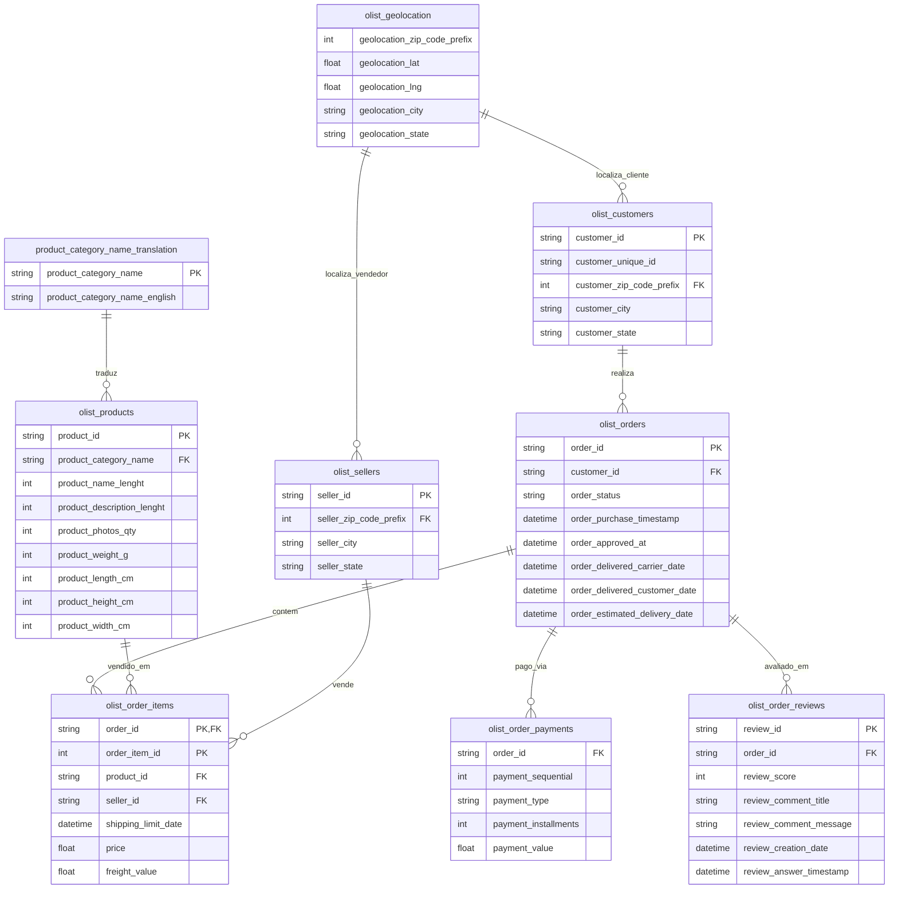

# Modelo de Dados — Olist

```mermaid
erDiagram
    olist_customers {
        string customer_id PK
        string customer_unique_id
        int customer_zip_code_prefix FK
        string customer_city
        string customer_state
    }
    olist_orders {
        string order_id PK
        string customer_id FK
        string order_status
        datetime order_purchase_timestamp
        datetime order_approved_at
        datetime order_delivered_carrier_date
        datetime order_delivered_customer_date
        datetime order_estimated_delivery_date
    }
    olist_order_items {
        string order_id PK, FK
        int order_item_id PK
        string product_id FK
        string seller_id FK
        datetime shipping_limit_date
        float price
        float freight_value
    }
    olist_order_payments {
        string order_id FK
        int payment_sequential
        string payment_type
        int payment_installments
        float payment_value
    }
    olist_order_reviews {
        string review_id PK
        string order_id FK
        int review_score
        string review_comment_title
        string review_comment_message
        datetime review_creation_date
        datetime review_answer_timestamp
    }
    olist_products {
        string product_id PK
        string product_category_name FK
        int product_name_lenght
        int product_description_lenght
        int product_photos_qty
        int product_weight_g
        int product_length_cm
        int product_height_cm
        int product_width_cm
    }
    olist_sellers {
        string seller_id PK
        int seller_zip_code_prefix FK
        string seller_city
        string seller_state
    }
    product_category_name_translation {
        string product_category_name PK
        string product_category_name_english
    }
    olist_geolocation {
        int geolocation_zip_code_prefix
        float geolocation_lat
        float geolocation_lng
        string geolocation_city
        string geolocation_state
    }

    olist_customers ||--o{ olist_orders : "realiza"
    olist_orders ||--o{ olist_order_items : "contem"
    olist_orders ||--o{ olist_order_payments : "pago_via"
    olist_orders ||--o{ olist_order_reviews : "avaliado_em"
    olist_products ||--o{ olist_order_items : "vendido_em"
    olist_sellers ||--o{ olist_order_items : "vende"
    product_category_name_translation ||--o{ olist_products : "traduz"
    olist_geolocation ||--o{ olist_customers : "localiza_cliente"
    olist_geolocation ||--o{ olist_sellers : "localiza_vendedor"
```
