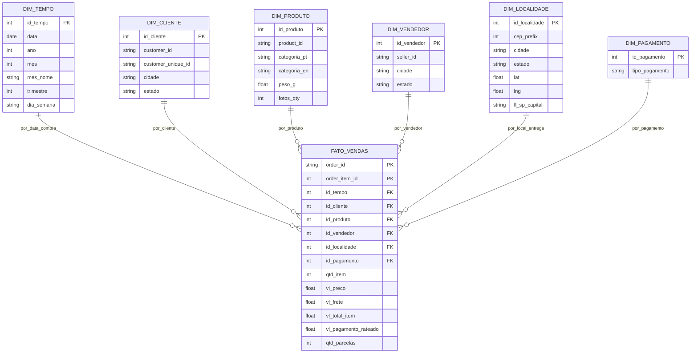

# Modelagem Dimensional — Volume de Vendas (< 500, SP Capital, 2017)

## 1. Objetivo analítico
Responder: **qual o volume de vendas com valor < 500, na capital de SP, no ano de 2017?**

- Volume = `COUNT(DISTINCT order_id)` + `SUM(qtd_item)` + `SUM(vl_total)`
- Filtros:
  - `valor < 500` → medida da FATO (`vl_pagamento` / `vl_preco`)
  - `SP capital` → `DIM_LOCALIDADE.cidade = 'sao paulo' AND estado = 'SP' + fl_sp_capital = 'S'`
  - `ano 2017` → `DIM_TEMPO.ano = 2017` (a partir de `order_purchase_timestamp`)

## 2. Grão
**1 linha da FATO = 1 item de pedido (`order_id + order_item_id`)**

Por quê: `olist_order_items` já está nesse grão e concentra `price + freight`. Permite somar e depois aplicar filtro `< 500` no item ou agregar por pedido.

## 3. Star Schema (Mermaid)



## 4. Mapeamento origem → destino (ETL)

| Tabela destino | Origem | Regra |
|---|---|---|
| `DIM_TEMPO` | `olist_orders.order_purchase_timestamp` | `ano=YEAR()`, `mes=MONTH()`, gerar surrogate `id_tempo = YYYYMMDD` |
| `DIM_CLIENTE` | `olist_customers` | SCD1, padronizar `lower(cidade)`. Manter `customer_unique_id` para deduplicar pessoa |
| `DIM_PRODUTO` | `olist_products + product_category_name_translation` | JOIN por `product_category_name`. Tratar nulos de categoria |
| `DIM_VENDEDOR` | `olist_sellers` | SCD1 |
| `DIM_LOCALIDADE` | `olist_geolocation` | Agrupar por `zip_code_prefix + cidade + estado`, tirar média de `lat/lng`. Criar `fl_sp_capital = 'S' quando cidade='sao paulo' e estado='SP'` |
| `DIM_PAGAMENTO` | `olist_order_payments.payment_type` | `credit_card, boleto, voucher, debit_card` |
| `FATO_VENDAS` | `olist_order_items + olist_orders + olist_order_payments` | JOIN `order_id`. `vl_total_item = price + freight_value`. `vl_pagamento_rateado = payment_value / qtd_itens_pedido` para não duplicar. `qtd_item = 1` por linha |

> Filtros de qualidade para a pergunta: `order_status = 'delivered'`, `order_purchase_timestamp BETWEEN '2017-01-01' AND '2017-12-31'`.

## 5. Como responder a pergunta (exemplo SQL / DAX)

```sql
SELECT
  COUNT(DISTINCT f.order_id) AS qtd_pedidos,
  SUM(f.qtd_item) AS qtd_itens,
  SUM(f.vl_total_item) AS receita_total
FROM FATO_VENDAS f
JOIN DIM_TEMPO t ON t.id_tempo = f.id_tempo
JOIN DIM_LOCALIDADE l ON l.id_localidade = f.id_localidade
WHERE t.ano = 2017
  AND l.cidade = 'sao paulo'
  AND l.estado = 'SP'
  AND l.fl_sp_capital = 'S'
  AND f.vl_total_item < 500;
```

Variante por valor do pedido (não do item):

```sql
-- agrega primeiro por pedido, depois filtra < 500
WITH pedido AS (
  SELECT order_id, SUM(vl_total_item) AS vl_pedido
  FROM FATO_VENDAS GROUP BY order_id
)
SELECT COUNT(*) FROM pedido WHERE vl_pedido < 500;
```

Em Power BI / DAX:
`Volume SP 2017 <500 = CALCULATE([Receita], DIM_TEMPO[ano]=2017, DIM_LOCALIDADE[fl_sp_capital]="S", FATO_VENDAS[vl_total_item]<500)`
```

